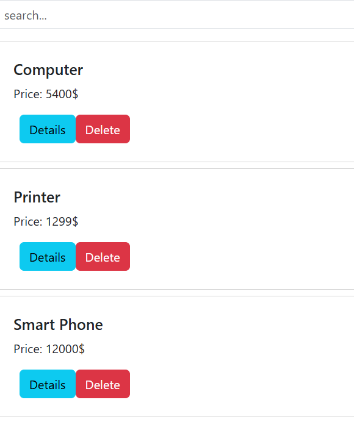
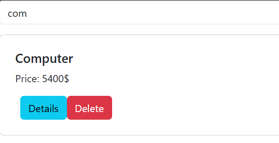

# Rapport de Travaux Pratiques : Bases angulaires

**Filière :** GLSID - Génie du Logiciel et des Systèmes Informatiques Distribués  
**Encadrant :** Mohamed YOUSSFI  
**Étudiant(e) :** Youness HATTABI

---

## Table des Matières

1. [Introduction](#1-introduction)
2. [Architecture générale de l'application](#2-architecture-générale-de-lapplication)
3. [Le Modèle — `Product`](#3-le-modèle--product)
4. [Le Service — `ProductService`](#4-le-service--productservice)
5. [Le Routage — `app.routes.ts`](#5-le-routage--approutests)
6. [Les Composants](#6-les-composants)
   - 6.1 [Composant liste — `ProductListComponent`](#61-composant-liste--productlistcomponent)
   - 6.2 [Composant élément — `ProductItemComponent`](#62-composant-élément--productitemcomponent)
7. [Conclusion](#7-conclusion)

---

## 1. Introduction

Angular est un framework front-end développé et maintenu par Google, fondé sur le langage TypeScript. Il repose sur une architecture orientée composants et propose un ensemble de mécanismes structurants — modules, services, injection de dépendances, routage, liaison de données — qui facilitent le développement d'applications web de grande envergure, maintenables et testables.

Ce rapport présente la réalisation d'une application Angular de gestion de produits, dont le back-end est assuré par une API REST Spring Boot. L'objectif principal est de mettre en pratique les concepts fondamentaux d'Angular : définition d'un modèle de données, communication avec une API distante via un service dédié, navigation entre vues grâce au routeur, et structuration de l'interface en composants réutilisables.

---

```
src/
└── app/
    ├── models/
    │   └── product.ts          ← Interface TypeScript du produit
    ├── services/
    │   └── product.service.ts        ← Appels HTTP vers le back-end Spring Boot
    ├── components/
    │   ├── product-list/
    │   │   ├── product-list.ts
    │   │   ├── product-list.html
    |   |   └── product-list.css
    │   └── product-item/
    │       ├── product-item.ts
    │       ├── product-item.html
    |       └── product-list.css
    ├── app.routes.ts                 ← Déclaration des routes
    └── app.ts
```

Le schéma ci-dessous illustre les interactions entre les différentes couches de l'application :

```
┌─────────────────────────────────────────────┐
│               Navigateur (Client)            │
│                                             │
│   ┌──────────────┐     ┌─────────────────┐  │
│   │ ProductList  │────▶│   ProductItem   │  │
│   │  Component   │     │   Component     │  │
│   └──────┬───────┘     └────────┬────────┘  │
│          │                      │           │
│          └──────────┬───────────┘           │
│                     ▼                       │
│           ┌──────────────────┐              │
│           │  ProductService  │              │
│           │   (HttpClient)   │              │
│           └────────┬─────────┘              │
└────────────────────┼────────────────────────┘
                     │ HTTP (REST)
                     ▼
        ┌────────────────────────┐
        │   Spring Boot Back-End │
        │   API REST /products   │
        └────────────────────────┘
```

---

## 3. Le Modèle — `Product`

En TypeScript, un modèle est généralement défini sous la forme d'une **interface**, ce qui permet de typer statiquement les objets manipulés dans l'application sans générer de code JavaScript superflu à la compilation. Cette interface reflète fidèlement la structure de l'entité JPA exposée par le back-end Spring Boot.

```typescript
// models/product.ts
export interface Product {
  id: number;
  name: string;
  price: number;
  quantity: number;
  selected: boolean;
}
```

L'utilisation d'une interface TypeScript présente plusieurs avantages notables : la détection des erreurs de typage à la compilation, l'autocomplétion dans l'éditeur, et une documentation implicite de la structure des données échangées avec l'API.

---

## 4. Le Service — `ProductService`

Dans l'architecture Angular, les **services** constituent la couche dédiée à la logique métier et à la communication avec les sources de données externes. Ils sont décorés avec `@Injectable` et mis à disposition de l'ensemble de l'application via le mécanisme d'injection de dépendances.

`ProductService` encapsule toutes les interactions avec l'API REST Spring Boot en utilisant le module `HttpClient` d'Angular. Il expose des méthodes retournant des `Observable`, qui sont ensuite consommés dans les composants via la syntaxe `subscribe()` ou le pipe `async`.

```typescript
// services/product.service.ts
import { Injectable } from "@angular/core";
import { HttpClient } from "@angular/common/http";
import { Observable } from "rxjs";
import { Product } from "../models/product";
@Injectable({
  providedIn: "root",
})
export class ProductService {
  private apiUrl = "http://localhost:8083/products";

  constructor(private httpClient: HttpClient) {}

  getAllProducts(): Observable<Product[]> {
    return this.httpClient.get<Product[]>(this.apiUrl);
  }

  getProduct(id: number): Observable<Product> {
    return this.httpClient.get<Product>(`${this.apiUrl}/${id}`);
  }

  deleteProdcut(id: number): Observable<void> {
    return this.httpClient.delete<void>(`${this.apiUrl}/${id}`);
  }
}
```

#### Le recours aux `Observable` (issus de la bibliothèque RxJS) plutôt qu'aux `Promise` classiques offre une gestion plus fine des flux de données asynchrones, notamment en permettant l'annulation de requêtes, la combinaison de flux et l'application d'opérateurs de transformation.

## 5. Le Routage — `app.routes.ts`

Le **routeur Angular** permet de définir une correspondance entre les URL du navigateur et les composants à afficher, offrant ainsi une expérience de navigation fluide caractéristique des applications _Single Page Application_ (SPA). Avec Angular 17+, la configuration du routage est définie directement dans un fichier `app.routes.ts` sous la forme d'un tableau de routes, sans nécessiter de `NgModule` dédié.

```typescript
// app.routes.ts
import { Routes } from "@angular/router";
import { ProductList } from "./components/product-list/product-list/product-list";

export const routes: Routes = [
  { path: "", redirectTo: "products", pathMatch: "full" },
  { path: "products", component: ProductList },
];
```

La directive `<router-outlet>` placée dans le template du composant racine (`AppComponent`) sert de point d'insertion dynamique dans lequel Angular injecte le composant correspondant à la route active. Ce mécanisme est au cœur du fonctionnement SPA, car il évite le rechargement complet de la page lors des transitions entre vues.

---

## 6. Les Composants

Un **composant** Angular est l'unité fondamentale de composition de l'interface utilisateur. Il est constitué d'une classe TypeScript annotée `@Component`, d'un template HTML et optionnellement d'une feuille de style. Chaque composant encapsule sa propre logique d'affichage et communique avec ses pairs via des mécanismes d'entrée (`@Input`) et de sortie (`@Output`).

### 6.1 Composant liste — `ProductListComponent`

`ProductListComponent` constitue la vue principale de l'application. Il est responsable de la récupération de la liste des produits via `ProductService`, de leur affichage sous forme de liste, et du filtrage en temps réel via une barre de recherche.

#### Classe du composant

```typescript
// components/product-list/product-list.ts
import { Component, OnInit, signal } from "@angular/core";
import { Product } from "../../../models/product";
import { ProductService } from "../../../services/product.service";
import { ProductItem } from "../../product-item/product-item/product-item";
import { CommonModule } from "@angular/common";
import { FormsModule } from "@angular/forms";

@Component({
  selector: "app-product-list",
  imports: [ProductItem, CommonModule, FormsModule],
  templateUrl: "./product-list.html",
  styleUrl: "./product-list.css",
  standalone: true,
})
export class ProductList implements OnInit {
  products = signal<Product[]>([]);
  loading = signal(true);
  searchTerm: string = "";
  selectedProduct?: Product;

  constructor(private productService: ProductService) {}

  ngOnInit(): void {
    this.loadProducts();
  }

  loadProducts(): void {
    this.productService.getAllProducts().subscribe({
      next: (data) => {
        this.products.set(data);
        this.loading.set(false);
        //this.cdr.markForCheck();
      },
      error: (error) => console.error(error),
    });
  }

  getProduct(id: number) {
    this.productService.getProduct(id).subscribe({
      next: (data) => {
        this.selectedProduct = data;
      },
      error: (error) => console.error(error),
    });
  }

  deleteProduct(id: number) {
    this.productService.deleteProdcut(id).subscribe({
      next: () => {
        this.products.update((current) =>
          current.filter((product) => product.id !== id),
        );
      },
      error: (error) => console.log(error),
    });
  }

  searchProducts() {
    if (this.searchTerm.trim() === "") {
      this.loadProducts();
    } else {
      const term = this.searchTerm.toLowerCase().trim();
      this.products.update((current) =>
        current.filter((product) => product.name.toLowerCase().includes(term)),
      );
    }
  }

  trackById(idx: number, product: Product) {
    return product.id;
  }
}
```

#### Template HTML

```html
<!-- components/product-list/product-list.html -->
<input
  type="text"
  class="form-control mb-3"
  placeholder="search..."
  [(ngModel)]="searchTerm"
  (ngModelChange)="searchProducts()" />

<p *ngIf="loading()">Loading.....</p>

<div *ngIf="!loading()">
  <div *ngFor="let product of products(); trackBy: trackById">
    <app-product-item
      [product]="product"
      (delete)="deleteProduct($event)"
      (details)="getProduct($event)"></app-product-item>
  </div>
</div>

<div class="modal fade show d-block" *ngIf="selectedProduct">
  <div class="modal-dialog">
    <div class="modal-content p-3">
      <h4>{{ selectedProduct.name }}</h4>
      <p>Price: {{ selectedProduct.price }}</p>
      <p>Quantity: {{ selectedProduct.quantity }}</p>

      <button class="btn btn-secondary" (click)="selectedProduct = undefined">
        Close
      </button>
    </div>
  </div>
</div>
```





#### Points techniques notables

La barre de recherche exploite la **liaison de données bidirectionnelle** (`[(ngModel)]`) pour filtrer les produits affichés sans déclencher de nouvel appel HTTP. La directive `*ngFor` itère sur le tableau de produits pour instancier dynamiquement un `ProductItemComponent` pour chaque entrée. La communication entre les deux composants s'effectue via la propriété `@Input()` de `ProductItemComponent`, à laquelle `ProductListComponent` transmet l'objet produit courant.

---

### 6.2 Composant élément — `ProductItemComponent`

`ProductItemComponent` est un composant de présentation (_presentational component_) dont le rôle est d'afficher les informations d'un produit individuel. Il reçoit ses données exclusivement via `@Input()` et remonte les actions utilisateur vers le composant parent via `@Output()`.

Chaque instance du composant affiche :

- Le **nom** du produit
- Le **prix** du produit
- Un bouton de **suppression**, qui déclenche un appel au service puis notifie le composant parent de rafraîchir la liste
- Un bouton **Détails**, qui ouvre une **modale Bootstrap** affichant l'ensemble des informations du produit

#### Classe du composant

```typescript
// components/product-item/product-item.ts
import { Component, EventEmitter, Input, OnInit, Output } from "@angular/core";
import { Product } from "../../../models/product";

@Component({
  selector: "app-product-item",
  imports: [],
  templateUrl: "./product-item.html",
  styleUrl: "./product-item.css",
  standalone: true,
})
export class ProductItem implements OnInit {
  @Input() product!: Product;
  @Output() delete = new EventEmitter<number>();
  @Output() details = new EventEmitter<number>();

  viewDetails() {
    this.details.emit(this.product.id);
  }

  onDelete() {
    this.delete.emit(this.product.id);
  }

  ngOnInit(): void {}
}
```

#### Template HTML

```html
<!-- components/product-item/product-item.html -->
<div class="card p-2 mb-2">
  <div class="card-body">
    <h5 class="card-title">{{ product.name }}</h5>
    <p class="card-text">Price: {{ product.price }}$</p>
    <button (click)="viewDetails()" class="btn btn-info ms-2">Details</button>
    <button (click)="onDelete()" class="btn btn-danger">Delete</button>
  </div>
</div>
```

#### Points techniques notables

L'intégration de la **modale Bootstrap** illustre l'interopérabilité entre Angular et les bibliothèques JavaScript tierces. La séparation entre `ProductListComponent` (composant conteneur) et `ProductItemComponent` (composant de présentation) est une pratique architecturale recommandée qui améliore la réutilisabilité et la testabilité du code.

---

## 7. Conclusion

Ces travaux pratiques ont permis de prendre en main les fondamentaux du framework Angular à travers la réalisation d'une application de gestion de produits connectée à une API Spring Boot. Les concepts abordés — modèle TypeScript, service injectable, routage SPA, composants avec `@Input` / `@Output`, directives structurelles et intégration Bootstrap — constituent le socle sur lequel repose tout développement Angular plus avancé.

La séparation claire des responsabilités entre le service (logique d'accès aux données), les composants conteneurs (orchestration) et les composants de présentation (affichage) reflète les bonnes pratiques architecturales préconisées par la communauté Angular. Cette organisation facilite la maintenance, l'évolution et les tests unitaires de l'application.
